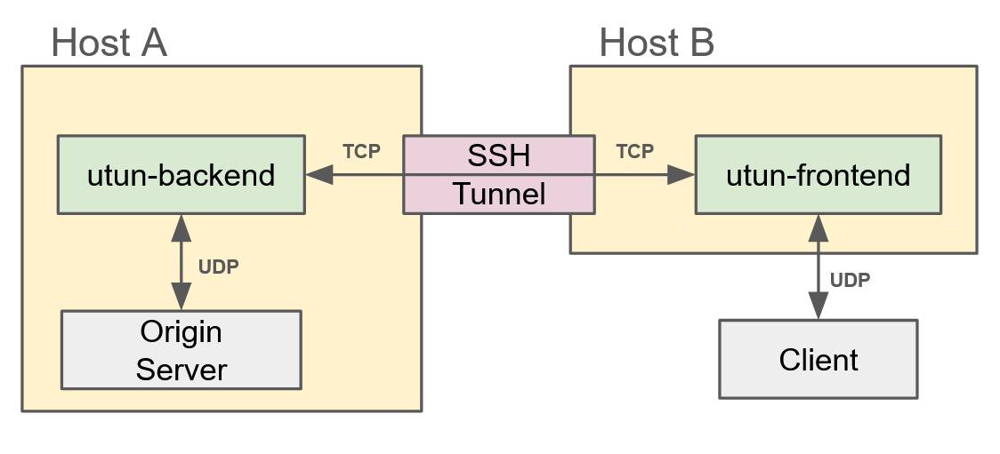

# utun

A small tool for tunneling UDP over TCP.

This tool can be used to securely publish applications that use UDP, such as game servers like Palworld, through SSH tunnels or similar methods, without exposing your home IP address.

## How It Works



This tool consists of two components: `utun-frontend` and `utun-backend`.

`utun-frontend` converts UDP communication from the client to TCP, while `utun-backend` converts the TCP communication back to UDP.
Because `utun-frontend` and `utun-backend` communicate over TCP, their connection can be routed through an SSH tunnel or similar methods.

## Requirements

* Python 3 (tested with 3.10)

## Installation

```sh
pip install git+https://github.com/ttk1/utun.git
```

## Usage

```sh
$ utun-frontend -h
usage: utun-frontend [-h] [--host HOST] [--port PORT] [--backend-host BACKEND_HOST]
                     [--backend-port BACKEND_PORT]

options:
  -h, --help            show this help message and exit
  --host HOST           frontend host, default: 0.0.0.0
  --port PORT           frontend port, default: 9999
  --backend-host BACKEND_HOST
                        backend host, default: 127.0.0.1
  --backend-port BACKEND_PORT
                        backend port, default: 8888
$ utun-backend -h
usage: utun-backend [-h] [--host HOST] [--port PORT] [--origin-host ORIGIN_HOST]
                    [--origin-port ORIGIN_PORT]

options:
  -h, --help            show this help message and exit
  --host HOST           backend host, default: 0.0.0.0
  --port PORT           backend port, default: 8888
  --origin-host ORIGIN_HOST
                        origin host, default: 127.0.0.1
  --origin-port ORIGIN_PORT
                        origin port, default: 8211
```

## Example

Here is an example for running everything locally for simplicity.

First, run `utun-frontend` and `utun-backend` with the following command.

```sh
$ (trap 'kill 0' SIGINT; utun-frontend & utun-backend & wait)
```

Next, start the server with the following command.

```sh
$ echo 'hello from server!' | nc -u -l 8211
```

Finally, send a request from the client to the server via utun with the following command.

```sh
$ echo 'hello from client!' | nc -u 127.0.0.1 9999
```

The messages exchanged will then be displayed on the other screen.

If you want to run `utun-frontend` and `utun-backend` on separate hosts, create an SSH tunnel with the following command.

```sh
$ ssh frontend-host -R 8888:localhost:8888
```

# Note

At this point, there are no access restrictions implemented, such as rate limiting or IP address whitelisting.
Please use the OS's firewall features or similar tools.
